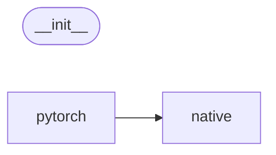

# Code Overview

[_Documentation generated by Documatic_](https://www.documatic.com)

<!---Documatic-section-Codebase Structure Python-start--->
## Codebase Structure Python

The codebase has a 2-deep folder structure,
                with 9 code files in total.

<!---Documatic-block-system_architecture-start--->

<!---Documatic-block-system_architecture-end--->

# #
<!---Documatic-section-Codebase Structure Python-end--->

<!---Documatic-section-Important Functions-start--->
## Important Functions

<!---Documatic-block-important_funcs-start--->
<!---Documatic-block-most_used_funcs-start--->
### Most Utilised Functions

* [smplpytorch.native.webuser.serialization.ready_arguments](4-smplpytorch_native.md#smplpytorch.native.webuser.serialization.ready_arguments) (1 times)
* [smplpytorch.pytorch.tensutils.th_posemap_axisang](3-smplpytorch_pytorch.md#smplpytorch.pytorch.tensutils.th_posemap_axisang) (1 times)
* [smplpytorch.pytorch.tensutils.th_with_zeros](3-smplpytorch_pytorch.md#smplpytorch.pytorch.tensutils.th_with_zeros) (1 times)
* [smplpytorch.pytorch.tensutils.th_pack](3-smplpytorch_pytorch.md#smplpytorch.pytorch.tensutils.th_pack) (1 times)
* [smplpytorch.pytorch.tensutils.make_list](3-smplpytorch_pytorch.md#smplpytorch.pytorch.tensutils.make_list) (1 times)
* [smplpytorch.pytorch.tensutils.subtract_flat_id](3-smplpytorch_pytorch.md#smplpytorch.pytorch.tensutils.subtract_flat_id) (1 times)
* [smplpytorch.native.webuser.posemapper.posemap](4-smplpytorch_native.md#smplpytorch.native.webuser.posemapper.posemap) (1 times)
<!---Documatic-block-most_used_funcs-end--->
<!---Documatic-block-important_funcs-end--->

# #
<!---Documatic-section-Important Functions-end--->

<!---Documatic-section-File IO-start--->
## File IO

<!---Documatic-block-file_io-start--->
The following files have file read operations

<!---Documatic-block-smplpytorch.native-start--->

	
<code>smplpytorch.native</code> (Click to Expand!)

* smplpytorch.native.webuser.serialization

<!---Documatic-block-smplpytorch.native-end--->
<!---Documatic-block-file_io-end--->

# #
<!---Documatic-section-File IO-end--->

<!---Documatic-section-Class Hierarchy-start--->
## Class Hierarchy

<!---Documatic-block-Module-start--->

	
<code>Module</code> (Click to Expand!)

* smplpytorch.pytorch.smpl_layer.SMPL_Layer

<!---Documatic-block-Module-end--->

<!---Documatic-block-ch.Ch-start--->

	
<code>ch.Ch</code> (Click to Expand!)

* smplpytorch.native.webuser.posemapper.Rodrigues

<!---Documatic-block-ch.Ch-end--->

# #
<!---Documatic-section-Class Hierarchy-end--->

[_Documentation generated by Documatic_](https://www.documatic.com)